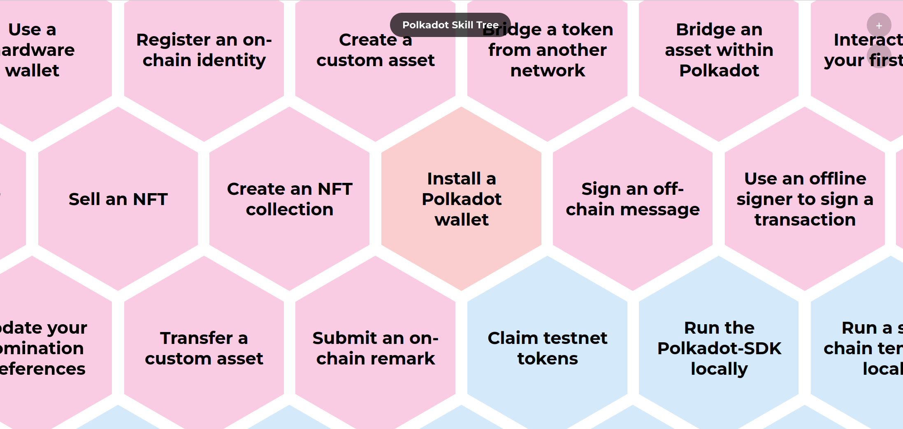

# polkadot-skilltree

Visual map of cool stuff you can do on Polkadot. 

# Contributing 

## Skills 

The main file you need to edit to add a skill is skilltree.yaml 

## Design 

This is a simple HTML/JS/CSS website and I'd like to keep it that way, so no npm/yarn or anything that introduces a build step. Ideally the edits should be simple enough.

## TODOs

- [ ] Add borders to the honeycombs (I tried multiple times but I didn't manage) 
- [ ] Add links to skills, wherever applicable
- [ ] Allow skills to be filtered depending on specific tracks (developers, fun, community, etc)
